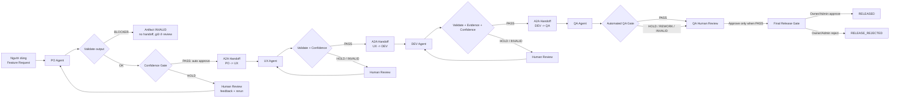

# Workflow Hiện Tại Của AIDLC Control Platform

Tài liệu này mô tả workflow đang được triển khai trong repository hiện tại.
Mục tiêu là giải thích rõ luồng `PO -> UX -> DEV -> QA -> Final Release`, cơ chế
Human-in-the-Loop (HITL), A2A handoff, MCP tool bus, validation/INVALID,
artifact persistence, observability và ranh giới giữa phần đã chạy được với phần
mới dừng ở mức mock hoặc scaffold.

> Trạng thái hiện tại: demo chạy end-to-end trên **mock data**. Backend là
> Node.js/Express + Prisma (SQLite). State machine được **suy ra (derived)** từ
> `Task` + `HitlDecision`, không có model `Workflow` riêng.

## 1. Tổng Quan

Luồng chính bắt đầu trực tiếp từ PO Agent:



Intent Agent vẫn còn endpoint để tương thích dữ liệu cũ, nhưng không nằm trong
entry point của Build flow mới.

## 2. Các Thành Phần Chính

| Thành phần | Vai trò hiện tại |
| --- | --- |
| `frontend/` | React dashboard: Build, Audit, Outputs, review modal và final release gate |
| `backend/` | Node.js orchestration adapter: quản lý task, gate, validation, A2A handoff, artifact, audit, release decision, observability |
| `agents/` | Python FastAPI service: dispatch worker LangChain; DEV có thêm nhánh E2B tùy chọn |
| `mock-data/` | Artifact mẫu cho local demo khi `USE_MOCK_AGENTS=true` |
| `workspace/projects/` | Artifact text dài được ghi ra file theo project và task |
| `backend/scripts/demoSmoke.js` | Preflight chạy 6 scenario qua mock, assert đúng nhánh (`npm run demo:smoke`) |
| `.github/workflows/ci.yml` | CI: jest + db push (DB cô lập) + drift check + demo:smoke |

Backend hiện dùng orchestration adapter trong
`backend/src/services/SdlcWorkflowService.js`. Microsoft Agent Framework là
định hướng production, chưa thay thế adapter này.

## 3. Cách Người Dùng Khởi Động Workflow

Trong UI hiện tại:

1. Người dùng đăng nhập và tạo hoặc chọn project.
2. Người dùng bấm `New Feature Request`.
3. Modal thu thập: `title`, `description`, `priority`, `target_user`,
   `business_goal`, `constraints`. (Có nút **"Demo: Add Google login"** điền sẵn
   nội dung mẫu để demo nhanh.)
4. Frontend gọi:

```http
POST /api/v1/sdlc/run-po-agent
```

Payload chính:

```json
{
  "project_id": "project-id",
  "feature_request": {
    "title": "Add Google login",
    "description": "Allow users to sign in with Google OAuth",
    "priority": "High",
    "target_user": "End user",
    "business_goal": "Reduce sign-in friction",
    "constraints": []
  }
}
```

## 4. State Machine

Backend suy ra trạng thái workflow từ task mới nhất và HITL decision đã lưu
(`_deriveCurrentPhase`). Không có bảng `Workflow` riêng — trạng thái là derived.

```text
BACKLOG
  -> PO_RUNNING -> PO_REVIEW
  -> UX_RUNNING -> UX_REVIEW
  -> DEV_RUNNING -> DEV_REVIEW
  -> QA_RUNNING -> QA_REVIEW
  -> FINAL_REVIEW
  -> RELEASED | RELEASE_REJECTED
```

Nhánh lỗi: `PO_FAILED | UX_FAILED | DEV_FAILED | QA_FAILED`.

PO, UX và DEV thường không dừng ở review nếu output hợp lệ và đủ confidence —
backend tự approve và chạy worker tiếp theo. QA luôn dừng để con người duyệt.

Hai thuộc tính derived hỗ trợ UI và độ bền (không lưu cột mới):

- **`awaitingReview`**: mỗi phase trả `awaitingReview = (task completed) && (chưa
  committed) && (chưa có quyết định APPROVE)`. Frontend mở review modal dựa trên
  giá trị này.
- **Tie-break tất định**: khi chọn "task mới nhất" và "quyết định mới nhất",
  backend so theo `createdAt` rồi `id`. Điều này giúp rerun (và rerun song song)
  luôn derive ra cùng một phase, không kẹt ở quyết định cũ.

## 5. Chi Tiết Từng Worker

### 5.1 PO Agent

- Input: feature request, project context, feedback nếu rerun.
- Output: `prd`, `user_stories`, `acceptance_criteria`, `scope`, `out_of_scope`,
  `mcp_activity`.
- Mock mode gắn `risk_classification`. Request có từ khóa `login`/`oauth`/
  `authentication` được phân loại `HIGH` với tags `["auth", "oauth", "session"]`
  và `required_gates` gồm `security`.

### 5.2 UX Agent

- Input: PRD đã approve, user stories, acceptance criteria.
- Output: `ux_spec`, `user_flow`, `wireframe_spec`, `component_inventory`,
  `screens`.
- Chỉ chạy sau khi PO `completed`, committed, có A2A handoff hợp lệ và **không có
  artifact INVALID** (xem mục 7.4).

### 5.3 DEV Agent

- Input: PRD + acceptance criteria, UX spec + user flow, context, architecture
  ledger, feedback nếu rerun.
- Output: `implementation_plan`, `mock_code_diff`/`patch_diff`, `patch_format`,
  `changed_files`, `linked_ac_ids`, `sandbox_result`, `self_test_report`,
  `risk_assessment`, `security_notes`, `security_gate`.
- Hai nhánh: Local fallback (mặc định) và E2B (`USE_E2B_SANDBOX=true`).
- Với feature rủi ro cao (Google OAuth), DEV phải có security evidence. Trong
  mock, lần chạy đầu bị giữ với issue `oauth_state_csrf_missing`; sau reviewer
  feedback, DEV rerun sinh security notes và security gate `PASS`.

### 5.4 QA Agent

- Input: PRD + acceptance criteria, UX spec, DEV plan/patch/sandbox/risk.
- Output: `test_cases`, `qa_report`, `ac_coverage_matrix`, `test_run_report`,
  `regression_risks`, `security_findings`, `blocker_count`, `release_decision`,
  `release_reason`, `release_recommendation`.
- Sau khi QA xong, backend chạy quality gate deterministic và persist
  `gate_evaluation`. QA human approval bị khóa nếu recommendation chưa `PASS`.

## 6. Validation, Gate Policy Và HITL

### 6.1 Output Validation Và Trạng Thái INVALID

Sau khi worker tạo output, backend chạy `_validateGateOutput(role, output)` dựa
trên **output contract có version** (`OUTPUT_CONTRACTS`, version `gate-output.v1`)
— một nơi khai báo tường minh field bắt buộc theo từng vai, mức `BLOCKER` hoặc
`WARNING`. (Không dùng Ajv; predicate viết tay nhưng gom về một chỗ; có drift
test bắt thay đổi shape.)

- **BLOCKER** → artifact của run đó được đánh `status = INVALID`, **không** tạo
  handoff, **không** chuyển phase (giữ ở `*_REVIEW`).
- **WARNING** → vẫn đi tiếp nhưng được ghi nhận để review/audit.
- Output hợp lệ → `status = VALID`, đủ điều kiện auto-approve.

Cột `status` (`VALID | INVALID | PENDING`, default `VALID`) là một migration nhỏ,
additive trên `AgentArtifact` — không vỡ dữ liệu cũ.

### 6.2 Policy Theo Worker

| Worker | Gate mode | Hành vi |
| --- | --- | --- |
| PO | `confidence_based` | Auto approve nếu output VALID và an toàn |
| UX | `confidence_based` | Auto approve nếu output VALID và an toàn |
| DEV | `confidence_based` | Auto approve nếu patch/sandbox/evidence hợp lệ |
| QA | `strict_manual` | Luôn cần human decision |

Cấu hình gate gom trong `GATE_CONFIG` (đầu `SdlcWorkflowService.js`):

```text
AUTO_APPROVE_CONFIDENCE      = 0.80
BLOCKING_SEVERITY            = "BLOCKER"
RELEASE_BLOCKING_SEVERITIES  = ["BLOCKER", "CRITICAL", "HIGH"]
```

Backend chỉ auto approve PO/UX/DEV khi: confidence >= ngưỡng, validation không có
blocker, không có warning, không có security issue.

Ba nhánh bad-case được đảm bảo:

- **Confidence thấp → HOLD** (mở review, không auto-approve).
- **Thiếu evidence → chặn auto-approve** (validation blocker → INVALID).
- **QA blocker → khóa release** (`RELEASE_BLOCKING_SEVERITIES`).

### 6.3 Structured HITL Decision

```http
POST /api/v1/sdlc/tasks/:task_id/decision
```

| Action | Ý nghĩa |
| --- | --- |
| `approve` | Validate, commit output, tạo A2A handoff, mở khóa worker tiếp theo |
| `edit_approve` | Chỉnh output có cấu trúc (JSON Patch), tăng output version, validate rồi approve |
| `reject` | Gửi feedback để rerun đúng worker sở hữu output |

Decision payload: `decision_id` (idempotency key), `base_output_version`
(optimistic lock), `comment`, `retry_reason`, `target_fields`, `blocking_issues`,
`acceptance_checks`.

Nếu output confidence-based đang `HOLD`, backend chỉ chấp nhận `reject`. Mỗi step
tối đa ba rerun; vượt giới hạn → ghi decision `escalation_required` với trạng thái
`needs_human_resolution`. Audit event của gate decision có thêm `reason` và
`ruleHit`.

## 7. A2A Handoff

### 7.1 Khi nào tạo

Sau mỗi approval của PO/UX/DEV: commit task → lấy output artifacts → tạo envelope
`a2a_handoff.v1` → persist như `agent_artifacts` → khởi động worker downstream.
QA không tạo handoff downstream (sau QA là final release gate).

### 7.2 Contract theo chặng

| Handoff | Downstream inputs bắt buộc |
| --- | --- |
| PO -> UX | `prd`, `acceptance_criteria`, `risk_classification` |
| UX -> DEV | `ux_spec`, `wireframe_spec`, `risk_classification` |
| DEV -> QA | `patch_diff`, `sandbox_result`, `self_test_report`, `security_gate` |

### 7.3 Envelope (rút gọn)

```json
{
  "handoff_id": "uuid",
  "schema_version": "a2a_handoff.v1",
  "from_agent": "po-agent",
  "to_agent": "ux-agent",
  "source_task_id": "po-task-id",
  "attempt": 1,
  "output_artifact": { "task_id": "po-task-id", "hash": "sha256" },
  "approval": { "approval_id": "hitl-decision-id", "type": "auto_approve", "confidence": 0.95 },
  "integrity": { "artifact_hash": "sha256", "created_at": "ISO-8601" }
}
```

### 7.4 Integrity Check Trước Khi Downstream Chạy

`_requireApprovedTask` kiểm tra upstream task: đúng type, `completed`, committed,
**không có artifact INVALID**, có `a2a_handoff` đúng `schema_version`, và hash
trong handoff khớp `output_content_hash`. Thiếu bất kỳ điều kiện nào → từ chối
chạy worker tiếp theo (HTTP 409).

## 8. MCP Tool Bus

(Trạng thái không đổi so với bản trước.) Python agents service có ba lớp:
`worker -> mcp_client.call_tool -> tool_policy.require_allowed -> tool_registry
-> mock adapter`. Hard allow-list theo worker; tool ngoài danh sách → `PermissionError`.

| Worker | MCP tools được phép |
| --- | --- |
| PO | `confluence.read/write`, `docs.search`, `repo.read` |
| UX | `penpot.upsert/export`, `docs.search` |
| DEV | `github.read/write` |
| QA | `jira.read/write`, `testrail.write`, `test.run`, `scanner.run` |

Adapter hiện là credential-free local mock. `McpActivityPanel` trong UI là
status-derived visualization, chưa phải request-level telemetry stream.

## 9. Artifact Persistence

Output chi tiết persist trong `agent_artifacts`: `task_id`, `project_id`,
`agent_type`, `artifact_type`, `artifact_key`, `content_text`/`content_json`,
`content_hash`, `ordinal`, và **`status`** (`VALID | INVALID | PENDING`).

Artifact text dài ghi ra `workspace/projects/<project-id>/<task-id>/<filename>`,
DB lưu reference `FILE:<absolute-path>`; backend resolve khi trả frontend.
Downstream nhận context qua `_buildContextFromArtifacts()` (đọc từ DB, không phụ
thuộc payload tạm trong memory).

## 10. Agent Output Contract (mock ⇆ real)

Để chuẩn bị nối agent thật mà không lệch khuôn với mock, có một **contract nhỏ**
trong `backend/src/services/agentContract.js`:

```text
agent: run({ task, context }) -> output
version: agent-io.v1
REQUIRED_OUTPUT_KEYS:
  po-agent : prd, acceptance_criteria
  ux-agent : ux_spec
  dev-agent: patch_diff, sandbox_result, self_test_report
  qa-agent : ac_coverage_matrix, test_run_report
```

- Mock implementation là `_buildMockOutput(task, context)` (thuần, không chạm DB).
- `tests/integration/agent-contract.test.js` chạy mock qua suite (6/6) — agent
  thật sau này phải pass đúng suite đó.
- Đường agent thật cảnh báo non-fatal khi output thiếu key contract (bắt phân kỳ
  ngay khi nối agent thật).

## 11. SSE, Polling, Timeline Và UI

Sau khi tạo task, frontend subscribe `GET /api/v1/sdlc/status/:task_id` (SSE,
event `progress` / `completed` / `error`). Build page còn poll workflow status,
mở review modal khi `awaitingReview` đúng phase.

Audit/timeline:

- `GET /api/v1/sdlc/audit-trail/:project_id` trả `events` (agent run/complete,
  hitl decision, handoff, escalation, failure) **và** `phaseTransitions` — chuỗi
  `{ type: "PHASE_TRANSITION", from, to, cause, at, agent, taskId, requestId }`
  được synthesize từ event đã sắp xếp (không bảng mới).
- `GET /api/v1/sdlc/workflow/:id/timeline` là alias gọi thẳng audit trail (tên
  thân thiện cho UI).

Các trang UI: `/sdlc` (Build), `/sdlc/outputs` (artifacts + handoffs),
`/sdlc/audit` (timeline, HITL, escalations, metrics).

## 12. Resilience Và Error Handling

- **Error envelope chuẩn**: lỗi trả `{ status, code, message, phase, requestId }`.
- **Error codes**: `ARTIFACT_MISSING`, `HASH_MISMATCH`, `MOCK_PARSE_ERROR`
  (cộng các code suy từ HTTP status).
- **Mock file hỏng**: `JSON.parse` mock được bọc; file lỗi sinh `MOCK_PARSE_ERROR`
  rõ ràng và fail task, thay vì âm thầm fallback sang agent thật.
- **Process-level**: `unhandledRejection` / `uncaughtException` — ở dev/demo giữ
  server sống; ở `NODE_ENV=production` thì log + `exit(1)` để supervisor restart
  sạch (không phục vụ trên state hỏng).

## 13. Observability — requestId & Structured Logging

- Middleware `requestContext` (AsyncLocalStorage) gắn `requestId` cho mỗi request
  (nhận `x-request-id` nếu có), trả lại qua header và luồn xuyên suốt async chain.
- `requestId` xuất hiện trong **error response** và **log**, giúp nối log ↔ error
  khi debug. Không lưu vào schema/audit ở giai đoạn này (đẩy sang mốc production
  khi có lưu lượng cần truy vết chéo).
- Logger là **pino** (JSON line): mỗi dòng tự gắn `requestId` + `taskId`/`phase`
  từ context. Các log lõi (request, INVALID, task-failed, contract-divergence)
  đã structured.

## 14. Final Release Gate

Xuất hiện sau khi QA `completed`, committed, quality gate `PASS`, và QA human
decision `APPROVE`. Evidence summary: feature request, risk level/tags, output
version PO/UX/DEV/QA, DEV sandbox result, DEV security gate, QA recommendation,
coverage %, open blockers.

Chỉ project `owner`/`admin` được approve/reject. Còn blocker severity
`BLOCKER`/`CRITICAL`/`HIGH` → release approval bị khóa. Release đã finalize không
thể bị ghi đè.

## 15. Mock Mode Và Demo Scenarios

Bật demo local:

```env
# backend/.env
USE_MOCK_AGENTS=true
MOCK_LOW_CONFIDENCE_STAGE=dev-agent
# MOCK_SCENARIO=happy_path   # default khi env trong/sai; xem bang duoi
```

Mock đọc artifact từ `mock-data/<agent-type>/`. PO/UX/DEV mặc định confidence
`0.95`; worker được chọn bởi `MOCK_LOW_CONFIDENCE_STAGE` dừng ở `0.58`; sau
reviewer feedback rerun trả `0.92`.

**`MOCK_SCENARIO`** (cung co che env, khong tao thu muc mock thu hai) chon
nhanh demo tat dinh. UI scenario selector chi hien 6 scenario that; khong con
`Legacy (default)`. Neu env trong hoac sai, backend fallback ve `happy_path`.

| Scenario | Nhanh ky vong | Human Review / mock recovery |
| --- | --- | --- |
| `happy_path` | PO/UX/DEV auto-approve; QA pass va cho manual approve; Final Release co the `APPROVE` thanh `RELEASED` | Khong can rerun. |
| `low_confidence_hold` | Stage muc tieu (mac dinh DEV qua `MOCK_LOW_CONFIDENCE_STAGE`) tra confidence `0.58` -> HOLD | Nut `Fill demo review feedback` dien feedback ve confidence/evidence; rerun thong thuong recover len `0.92`. |
| `missing_evidence` | DEV thieu `sandbox_result.tests_ran` va `self_test_report` -> artifact `INVALID`, khong handoff QA | Preset review yeu cau `sandbox_result`, `self_test_report`, `sandbox_report`; rerun attach evidence, DEV `VALID`, unlock QA. |
| `qa_blocker` | QA co blocker + failed regression -> QA `INVALID`, release gate `LOCKED` | Preset review yeu cau rerun QA, `blocker_count=0`, `test_run_report.failed=0`; rerun QA `VALID` va cho QA manual approval. |
| `release_reject` | PO/UX/DEV/QA pass; reviewer reject o Final gate -> `RELEASE_REJECTED` | Khong phai worker rework; demo quyen quyet dinh release cuoi cung. |
| `escalation` | Stage muc tieu giu confidence `0.58` ke ca sau feedback -> reject lap -> `escalation_required` | Preset review co feedback rieng nhung mock co tinh khong recover de demo max retry/escalation. |

Mock output moi co artifact `scenario_brief` de UI/output biet scenario, stage,
expected outcome va demo signals. `Fill demo review feedback` doc
`agentOutput.scenario_brief.scenario` + stage hien tai de dien dung payload cho
tung scenario, khong dung chung mot mau OAuth/security cho tat ca nhanh.

## 16. CI Và Preflight

- **Preflight local**: `cd backend && npm run demo:smoke` chạy 6 scenario qua
  service in-process, assert đúng nhánh. Smoke **ép DATABASE_URL sang DB sqlite
  cô lập** (`smoke.db`) và tự `prisma db push` — không bao giờ chạm `dev.db`.
- **CI** (`.github/workflows/ci.yml`, GitHub Actions): `npm ci` → `prisma
  generate` → `db push` vào DB cô lập `ci.db` → **drift guard** `prisma migrate
  diff --exit-code` (repo dùng db push, không có migration history nên dùng
  `migrate diff` thay `migrate status`) → `npm test` → `npm run demo:smoke`.
  Nhánh hỏng → build đỏ → chặn merge.
- **DB isolation**: `prisma/schema.prisma` đọc `env("DATABASE_URL")`. Local dev
  trỏ `dev.db` qua `backend/.env`; jest cấp default qua `tests/setupEnv.js`;
  smoke/CI override sang file riêng.

## 17. API Chính

| Endpoint | Mục đích |
| --- | --- |
| `POST /api/v1/sdlc/run-po-agent` | Bắt đầu workflow PO-first |
| `POST /api/v1/sdlc/run-ux-agent` | Chạy UX từ PO handoff đã approve |
| `POST /api/v1/sdlc/run-dev-agent` | Chạy DEV từ UX handoff đã approve |
| `POST /api/v1/sdlc/run-qa-agent` | Chạy QA từ DEV handoff đã approve |
| `POST /api/v1/sdlc/tasks/:task_id/decision` | Submit structured HITL decision |
| `POST /api/v1/sdlc/tasks/:task_id/gate-decision` | HITL decision dạng đơn giản (legacy) |
| `GET /api/v1/sdlc/status/:task_id` | SSE task status |
| `GET /api/v1/sdlc/workflow-status?project_id=...` | Workflow state hiện tại (gồm `awaitingReview`, releaseGate) |
| `GET /api/v1/sdlc/projects/:project_id/artifacts` | Retained artifacts và A2A handoffs |
| `GET /api/v1/sdlc/audit-trail/:project_id` | Audit `events` + `phaseTransitions` |
| `GET /api/v1/sdlc/workflow/:id/timeline` | Alias của audit trail |
| `GET /api/v1/sdlc/projects/:project_id/metrics` | Workflow metrics |
| `POST /api/v1/sdlc/projects/:project_id/release-decision` | Final release decision |

Legacy compatibility: `POST /api/v1/sdlc/run-intent-agent`.

## 18. Những Phần Chưa Production-Ready

- MCP adapters vẫn là credential-free local mocks; chỉ PO worker gọi MCP client
  trực tiếp trong worker code.
- MCP panel UI là status-derived visualization, chưa phải request-level telemetry.
- Microsoft Agent Framework chưa thay thế Node.js orchestration adapter.
- DEV E2B path cần template, repository checkout/upload, artifact collection
  hoàn chỉnh cho production.
- `requestId` mới ở log + error response, chưa persist vào audit (đẩy sang mốc
  production cần truy vết chéo).
- Optimistic lock cho hai decision đồng thời (concurrent) để dành mốc multi-user.
- Hosted storage flow cần Supabase; local SQLite + JWT mock không phụ thuộc.

## 19. File Quan Trọng

| File | Trách nhiệm |
| --- | --- |
| `backend/src/services/SdlcWorkflowService.js` | State machine, gates, validation/INVALID, rerun, A2A handoff, artifact persistence, release evidence, mock builder, phaseTransitions |
| `backend/src/services/agentContract.js` | Agent I/O contract (`agent-io.v1`) + conformance checker |
| `backend/src/middleware/errorHandler.js` | Error envelope `{code,message,phase,requestId}` + `ERROR_CODES` |
| `backend/src/middleware/requestContext.js` | AsyncLocalStorage requestId context |
| `backend/src/config/logger.js` | pino structured logger (auto requestId/taskId/phase) |
| `backend/src/routes/sdlc.js` | SDLC API routes (gồm `/workflow/:id/timeline`) |
| `backend/src/controllers/SdlcController.js` | SDLC HTTP handlers và SSE |
| `backend/scripts/demoSmoke.js` | Preflight 6 scenario (DB cô lập) |
| `.github/workflows/ci.yml` | CI: test + drift check + demo:smoke |
| `agents/main.py` | FastAPI dispatch sang worker |
| `agents/src/mcp/*` | MCP audited call boundary, allow-list, registry, mock adapter |
| `frontend/src/pages/SdlcDashboard/index.tsx` | Build page orchestration UI |
| `frontend/src/pages/SdlcDashboard/components/HumanGatePanel.tsx` | Structured HITL review modal |
| `frontend/src/pages/SdlcDashboard/components/ReleaseGatePanel.tsx` | Final release evidence và decision |
| `frontend/src/pages/SdlcDashboard/components/FeatureRequestForm.tsx` | New feature modal + nút demo Google login |
